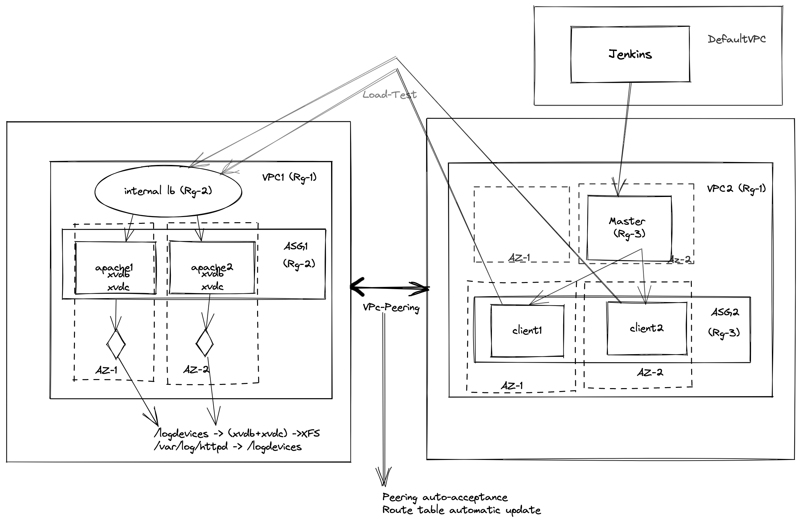

# Apache-JMeter Load Testing over VPC-Peering | Setup

## Terraform Solution

## Introduction

This is a simple, reusable terraform code (modules) to simulate JMeter master slave load testing over the VPC peering. The stack is divided into two parts.
1. Application Part (VPC 1) - Consisting of Apache servers in autoscaling having two disks each extended via LVM (Apache logs folder are available on this disk). The apache servers are exposed via private classic load balancer.
2. JMeter (VPC 2) - Consisting of JMeter master and client setup in autoscaling to simulate the load on the apache servers. 

> VPC 1 and VPC 2 are peered to make the communication working.

## Use case
The client's application is running in VPC 1 assuming to be Apache running in autoscaling mode over multiple availability zones (for the sake of example) and there is an entirely different setup in a different VPC having JMeter master slave setup to run load test on the apache machines exposed over private load balancers. This solution can be used with any infrastructure running on AWS where performance testing has to be done via JMeter setup.

## Services & Tools
1. AWS Cloud - VPC Peering, Private Load balancer, Autoscaling
2. Terraform
3. Bash
4. AWSCLI
5. Systems Manager - Parameter Store
6. JMeter

## How does this work

The solution is divided into three parts:
1. The terraform stack is used to setup first VPC (app-vpc), subnets, NAT, apache servers in autoscaling exposed by the private load balancer. The EC2 servers have userdata to install the apache servers, create LVM out of two disks, moving logs to the lvm mounted disk. Terraform also updates the Load balancer DNS in the SSM parameter store to be used for later.
2. The second terraform stack is used to setup second VPC (jmeter-vpc), NAT, jmeter master standalone server and client machines in autoscaling mode. The Jmeter servers have the userdata to install java and jmeter utility into the system
3. The third part consists of a pipeline which uses single pipeline to trigger the load test from the master server using a sample JMX which simulates the loadtest. There is a bash script which fetches load balancer DNS from the SSM parameter store and replaces in the file and then performs the load test.

## Pre-requisites
1. Appropriate AWS privileges on AWS account covering atleast landing zone creation, SSM, IAM etc.
2. Jenkins or any other CICD setup running to trigger the pipelines (Local system can also be used to run the commands)
3. Terraform installed on local or CICD server.
4. A pre-existing S3 bucket (to store remote terraform state)

## Assumptions & Considerations
1. Both the VPCs are in the same account and in the same region.
2. There is a separate Jenkins or CICD server which is used to spin up the infrastructure.
3. The PEM file is already on Jenkins machine so that it can SSH into the master server to run the ondemand load test.
4. LVM is needed to extend the disk partition if required at later point of time.

## Solution Architecture Diagram

## Areas of Improvment
  
1. Create dynamic Security groups and dynamic listener and health-checks for Load Balancer.
2. Capability to create Jmeter Master from different AMIs and user.
3. Store and use keys from vault/secrets.

  
  
## How to Contribute

- Fork the repository
- Submit a pull request to master branch of this repository
- Reach out to email address

